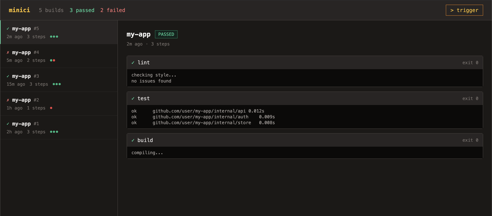

# minici

A minimal CI runner written in Go.

Watches a Git repository, triggers builds on commit, runs steps in containers, streams logs, and shows results in a dashboard.



**[Live Demo](https://heyitworked.github.io/minici/)**

## Status

| Module | Description | Status |
|--------|-------------|--------|
| Process execution | Run commands with timeout, capture output, stream logs live | ✅ |
| Git integration | Watch repo, detect commits, diff changed files | ✅ |
| Pipeline definition | Parse `pipeline.yaml`, run steps sequentially or in parallel | ✅ |
| Docker integration | Run pipeline steps inside containers (Docker Go SDK) | ✅ |
| Storage | Persist build results (JSON + SQLite), log writing | ✅ |
| HTTP dashboard | REST API + embedded HTML dashboard | ✅ |

## Getting Started

Requires [Docker](https://www.docker.com/) and [VS Code](https://code.visualstudio.com/) with the [Dev Containers](https://marketplace.visualstudio.com/items?itemName=ms-vscode-remote.remote-containers) extension.

```bash
git clone https://github.com/HeyItWorked/minici
cd minici
# Open in VS Code → "Reopen in Container"
go run ./cmd/minici
# Open http://localhost:8080
```

## Project Structure

```
cmd/minici/         # entrypoint
internal/runner/    # process execution — RunCommand, RunStreaming, RunInContainer
internal/git/       # git integration — GetLatestCommit, Watch, ChangedFiles
internal/pipeline/  # pipeline — Load YAML config, Run steps (sequential + parallel + container)
internal/store/     # persistence — JSONStore, SQLiteStore, LogStore
internal/api/       # HTTP server — REST endpoints, embedded dashboard
```
